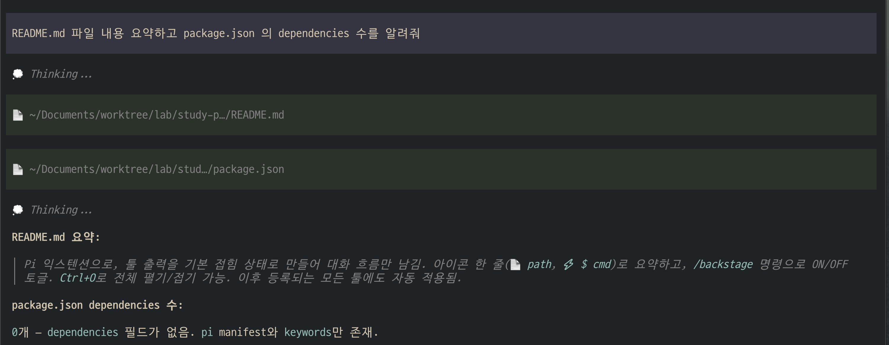
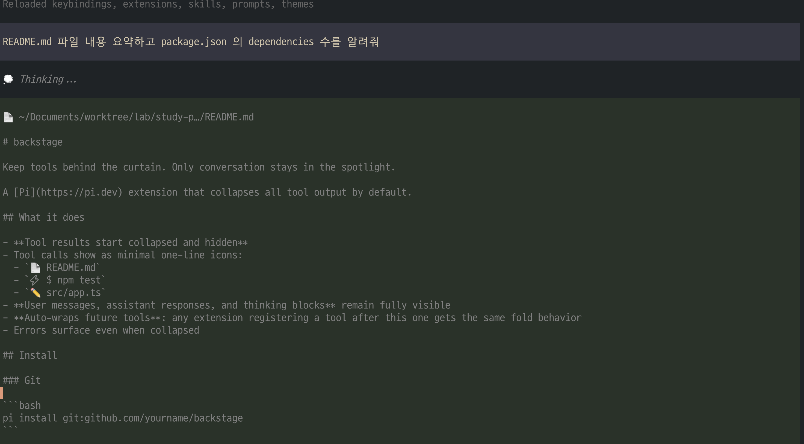
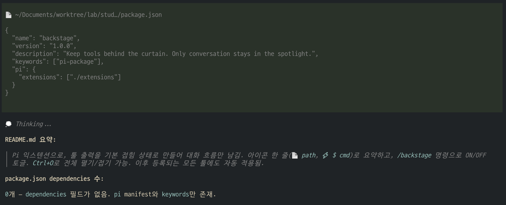

# backstage

Keep tools behind the curtain. Only conversation stays in the spotlight.

A [Pi](https://pi.dev) extension that collapses all tool output by default.

## What it does

- **Tool results start collapsed and hidden**
- Tool calls show as minimal one-line icons:
  - `📄 README.md`
  - `⚡ $ npm test`
  - `✏️ src/app.ts`
- **User messages, assistant responses, and thinking blocks** remain fully visible
- **Auto-wraps future tools**: any extension registering a tool after this one gets the same fold behavior
- Errors surface even when collapsed

## Before / After

### Collapsed (Backstage ON)

Only icons and one-line summaries. Clean conversation flow.



### Expanded (Backstage OFF)

Full tool output visible. Useful when you need details.



### Toggle

Switch between modes instantly with `/backstage`.



## Install

### Git

```bash
pi install git:github.com/eddy-jeon/pi-backstage
```

### Local

```bash
git clone https://github.com/eddy-jeon/pi-backstage.git
pi install ./pi-backstage
```

Or copy `extensions/backstage.ts` to `.pi/extensions/`.

## Usage

| Command | Action |
|---------|--------|
| `/backstage` | Toggle on/off |
| `Ctrl+O` | Expand/collapse all tools |


## Requirements

- Pi ≥ 0.13
